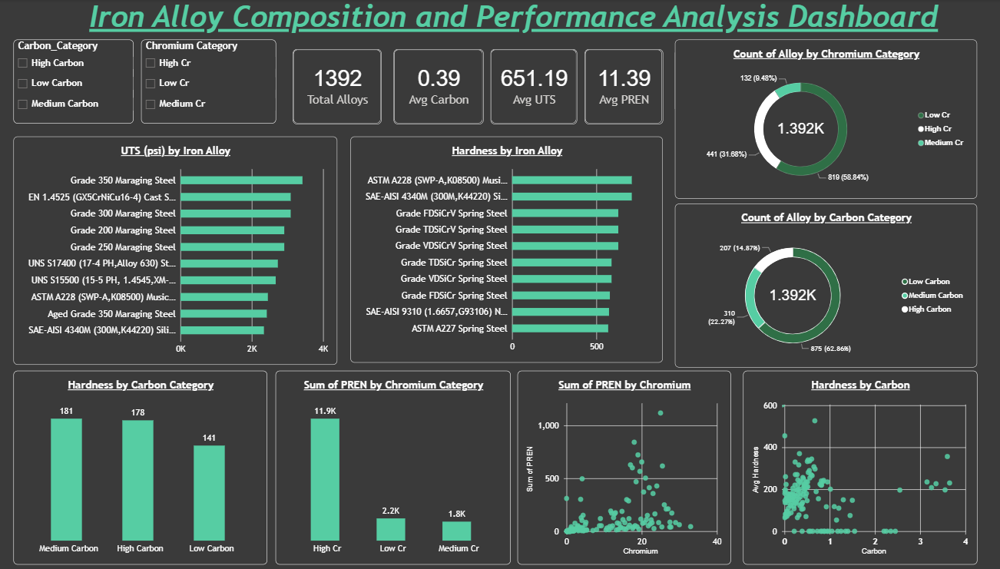

## Iron Alloy Composition and Performance Analysis

## Project Overview

This project analyzes iron alloy composition and its relationship with mechanical properties and corrosion resistance using Excel, SQL Server, and Power BI.

## Tools Used

* Microsoft Excel
* SQL Server
* Power BI
* GitHub

## Dataset

* 1,392 iron alloy records
* Mechanical property data (UTS, hardness, elongation, fracture toughness)
* Chemical composition data (Carbon, Chromium, Nickel, Molybdenum, etc.)
* PREN and density information

## Data Preparation

* Cleaned and transformed raw alloy data in Excel
* Created composition categories for Carbon and Chromium
* Handled missing values and standardized columns

## SQL Analysis

Performed analysis using SQL Server, including:

* Dataset overview
* Missing value analysis
* Top 10 strongest alloys
* Top 10 hardest alloys
* Carbon category vs hardness analysis
* Chromium category vs PREN analysis
* High-strength and high-hardness alloy identification

## Power BI Dashboard

The dashboard includes:

* KPI cards
* Top 10 strongest alloys
* Top 10 hardest alloys
* Carbon category vs hardness comparison
* Chromium category vs PREN comparison
* Scatter plot analysis
* Interactive slicers

## Dashboard Screenshot

## Project Files

* Iron_Alloy_Analysis.pbix
* SQL_Iron_Alloy_Analysis.sql
* Iron_Alloy_Analysis.xlsx

## Author

Lisha Kumari

